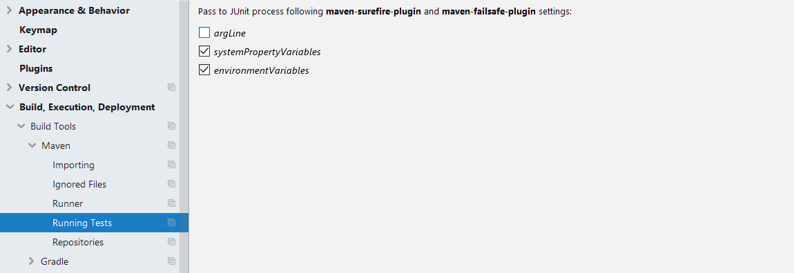

# openSAP Course: Create and Deliver Cloud-Native SAP S/4HANA Extensions

Welcome to our [course](https://open.sap.com/courses/s4h13) on creating and delivering game changing cloud-native SAP S/4HANA extensions.
This page explains how to use our example code repository and provides setup instructions.
In the section [Example Code and Additional Material](#example-code-and-additional-material), there are links to the complementary material and other information that help you to succeed in the do-it-yourself tasks of this course.
Please follow this section unit by unit while watching the videos of the openSAP course. 

## Requirements

During the course, we use IntelliJ IDEA for editing the code of our Java projects. You can get your free copy of the community edition [on this website](https://www.jetbrains.com/idea/download/).

Please follow the instructions outlined in [this blog post](https://blogs.sap.com/2017/05/15/step-1-with-sap-s4hana-cloud-sdk-set-up/) to install the JDK and Maven using a package manager on Windows or macOS.

You will need the following on your local machine to build and deploy the application:

* Java Development Kit (JDK), **version 8 (1.8.0)**
    * Please note that **only JDK version 8** works with the example source code as of now. Don't use any earlier or later version.
* Apache Maven, version 3.5.0, or above
* Git, version 2.15.0, or above for cloning the repository (Download from the [project homepage](https://git-scm.com/downloads))
* Cloud Foundry Command Line Interface (cf CLI) (refer to the [install instructions](https://docs.cloudfoundry.org/cf-cli/install-go-cli.html))
* Docker (Required for Week 3) (refer to the [install instructions](https://docs.docker.com/install/))

Verify the tools are installed correctly by running the commands `java -version`, `mvn -version`, `cf --version` and `git --version` in a terminal or command prompt.
Check that the environment variable `JAVA_HOME` points to the path of your JDK installation, e.g., `C:\Program Files\path\to\java\jdk1.8.0_72`.


## Get the example code

The example source code for this course is hosted in a [GitHub repository](https://github.com/SAP/cloud-s4-sdk-book).

To get the example code on your local machine, clone it from GitHub via `git clone https://github.com/SAP/cloud-s4-sdk-book`.
Alternatively, you can download the individual branches as ZIP files in the table below or linked in unit specific section.

Please note that this repository contains different branches, some of which are related to the openSAP course as explained below, while others are relevant for the [book](https://sap.github.io/cloud-s4-sdk-book/) only.
We recommend to use this repository as a reference throughout the course, and work on an `address-manager` repository in your own user account on GitHub.
Creating your own repository is described in unit 5 of week 1 of the course.

The example repository has branches for individual units in this course.
All branches prefixed with `course/` are relevant in the context of this course.
The branches are named according to the schema `course/{week}_{unit}_{label}`.
To inspect the source code of a particular state, either checkout the corresponding branch (if you have cloned the git repository, by running `git checkout course/{week}_{unit}_{label}`), view the branch on GitHub in your browser via the link in the first column, or download the project as an archive using the links provided in the last column below.

| Branch | Week/ Unit | Description | Download as Archive  |
|---|---|---|---|
| [course/2_1_copyover](https://github.com/SAP/cloud-s4-sdk-book/tree/course/2_1_copyover) | 2/1 | Delta containing front-end and command stubs to apply to your project | [ZIP](https://github.com/SAP/cloud-s4-sdk-book/archive/course/2_1_copyover.zip) |
| [course/2_1_start](https://github.com/SAP/cloud-s4-sdk-book/tree/course/2_1_start) | 2/1 | As an alternative to the copyover, use this branch for a fresh start | [ZIP](https://github.com/SAP/cloud-s4-sdk-book/archive/course/2_1_start.zip) |
| [course/2_2_start](https://github.com/SAP/cloud-s4-sdk-book/tree/course/2_2_start) | 2/2 | Starting point for the unit | [ZIP](https://github.com/SAP/cloud-s4-sdk-book/archive/course/2_2_start.zip) |
| [course/2_2_end](https://github.com/SAP/cloud-s4-sdk-book/tree/course/2_2_end) | 2/2 | Final state after the unit for reference | [ZIP](https://github.com/SAP/cloud-s4-sdk-book/archive/course/2_2_end.zip) |
| [course/2_3_security](https://github.com/SAP/cloud-s4-sdk-book/tree/course/2_3_security) | 2/3 | Adding security to our application | [ZIP](https://github.com/SAP/cloud-s4-sdk-book/archive/course/2_3_security.zip) |
| [course/2_4_multitenancy](https://github.com/SAP/cloud-s4-sdk-book/tree/course/2_4_multitenancy) | 2/4 | Making our application multi tenant-aware | [ZIP](https://github.com/SAP/cloud-s4-sdk-book/archive/course/2_4_multitenancy.zip) |
| [course/2_5_testing](https://github.com/SAP/cloud-s4-sdk-book/tree/course/2_5_testing) | 2/5 | Starting point for the unit | [ZIP](https://github.com/SAP/cloud-s4-sdk-book/archive/course/2_5_testing.zip) |
| [course/2_5_testing_practice](https://github.com/SAP/cloud-s4-sdk-book/tree/course/2_5_testing_practice) | 2/5 | Starting point for self-learning by implementing tests | [ZIP](https://github.com/SAP/cloud-s4-sdk-book/archive/course/2_5_testing_practice.zip) |
| [course/4_2_in_app_step1_start](https://github.com/SAP/cloud-s4-sdk-book/tree/course/4_2_in_app_step1_start) | 4/2 | Start for demo: Retrieving and storing information on last address check | [ZIP](https://github.com/SAP/cloud-s4-sdk-book/archive/course/4_2_in_app_step1_start.zip) |
| [course/4_2_in_app_step1_solution](https://github.com/SAP/cloud-s4-sdk-book/tree/course/4_2_in_app_step1_solution) | 4/2 | Solution for demo: Retrieving and storing information on last address check | [ZIP](https://github.com/SAP/cloud-s4-sdk-book/archive/course/4_2_in_app_step1_solution.zip) |
| [course/4_2_in_app_step2_start](https://github.com/SAP/cloud-s4-sdk-book/tree/course/4_2_in_app_step2_start) | 4/2 | Start for demo: Retrieving social media accounts | [ZIP](https://github.com/SAP/cloud-s4-sdk-book/archive/course/4_2_in_app_step2_start.zip) |
| [course/4_2_in_app_step2_solution](https://github.com/SAP/cloud-s4-sdk-book/tree/course/4_2_in_app_step2_solution) | 4/2 | Solution for demo: Retrieving social media accounts | [ZIP](https://github.com/SAP/cloud-s4-sdk-book/archive/course/4_2_in_app_step2_solution.zip) |
| [course/4_3_advanced_services_initial](https://github.com/SAP/cloud-s4-sdk-book/tree/course/4_3_advanced_services_initial) | 4/3 | Starting point for the unit | [ZIP](https://github.com/SAP/cloud-s4-sdk-book/archive/course/4_3_advanced_services_initial.zip) |
| [course/4_3_advanced_services_solution](https://github.com/SAP/cloud-s4-sdk-book/tree/course/4_3_advanced_services_solution) | 4/3 | Solution | [ZIP](https://github.com/SAP/cloud-s4-sdk-book/archive/course/4_3_advanced_services_solution.zip) |
| [course/4_4_eventing](https://github.com/SAP/cloud-s4-sdk-book/tree/course/4_4_eventing) | 4/4 | Example for consuming messages | [ZIP](https://github.com/SAP/cloud-s4-sdk-book/archive/course/4_4_eventing.zip) |

## Example Code and Additional Material

This section describes where to find the example code for the specific units. It also links additional material and important commands for each unit, where applicable.

### Week 1 Introducing Intelligent ERP

#### Unit 1 to 4

Just enjoy watching the videos for units 1 to 4. There is no preparation required.

#### Unit 5 Building a Hello World Extension App

Before starting with this unit make sure your environment has all the tools installed and configured as listed in the section [Requirements](#requirements).

In the openSAP course, you are asked to create a new project from our archetypes.
The command to generate a new project is the following.

For cmd (Windows):
``` cmd
mvn archetype:generate ^
"-DarchetypeGroupId=com.sap.cloud.s4hana.archetypes" ^
"-DarchetypeArtifactId=scp-cf-tomee" ^
"-DarchetypeVersion=2.1.2" ^
"-DgroupId=com.sap.cloud.s4hana.examples" ^
"-DartifactId=address-manager" ^
"-Dversion=1.0-SNAPSHOT"
```

For bash:

``` bash
mvn archetype:generate \
"-DarchetypeGroupId=com.sap.cloud.s4hana.archetypes" \
"-DarchetypeArtifactId=scp-cf-tomee" \
"-DarchetypeVersion=2.1.2" \
"-DgroupId=com.sap.cloud.s4hana.examples" \
"-DartifactId=address-manager" \
"-Dversion=1.0-SNAPSHOT"
```

The .gitignore file referenced in this unit can be found [here](http://tiny.cc/s4sdk-gitignore).

##### Troubleshooting:
* When starting the application locally, make sure the to the command `mvn tomee:run` in the `application` folder of your project. Otherwise, the command might fail with an error message like: 
`No plugin found for prefix 'tomee'`.

* If your subacount on SCP could not be created, please do the following:
Delete your subaccount and create a new one on the overview page of your global account.
Choose another name and value for the subdomain. 
Afterwards, enable Cloud Foundry in your subaccount to create an organization. 
Create a space and assign quota to the subaccount by going to the global account and select 'Entitlements' on the left. 
Add 'Application Runtime' to your subaccount.

* By default, the command `mvn tomee:run` will start a server on port 8080 and will also listen to some additional helper ports.
One of it is the shutdown port on 8005 which is often occupied on windows.
If these ports are already blocked by another application, the start of the address manager will fail. 
However, in this case you can change the port, e.g. by providing another port: `mvn -Dtomee-plugin.http=8180 -Dtomee-plugin.shutdown=8006 clean package tomee:run`. 
All available parameters can be found in the [documentation](http://tomee.apache.org/maven/run-mojo.html) of the tomee maven plugin.

### Week 2 Building Side-by-Side Extensions

#### Unit 1: Building a Basic Extension App

In this unit, please continue with the state of your example project as it was at the end of the last unit.
However, please also copy over some [additional resources](http://tiny.cc/s4sdk-2-1-copyover-zip), e.g. front-end, into your project as explained in the video. 
Extract the zip file and copy the src folder into the application folder of your project.

In case you want to download a fresh copy of the project as a starting point, checkout the git branch `course/2_1_start` or download the example project as [zip file](http://tiny.cc/s4sdk-2-1-start-zip).

#### Unit 2: Enhancing the Extension App

As in the last unit, you can continue working with your local example application as it was at the end of the unit.

In case you want to download a fresh copy of the project as a starting point, checkout the git branch `course/2_2_start` or download the example project as [zip file](http://tiny.cc/s4sdk-2-2-start-zip).

In this unit, you will learn the basics about how to build an extension application for S/4HANA Cloud and On-Premise. 
You can use your own S/4HANA for the experiments. 
To make following the course more convenient, also if you have no S/4HANA system at hand, you can also use a mock server.
Please follow the [guide](https://sap.github.io/cloud-s4-sdk-book/pages/mock-odata.html) as supplementary material on how to setup the mock server locally or on SAP Cloud Platform.
The guide also explains how to [connect your application](https://sap.github.io/cloud-s4-sdk-book/pages/mock-odata.html#connect-your-application-to-the-mock-server) to the mock server.

The final result of this unit can be found in the branch `course/2_2_end`. You can also download the [zip file](https://github.com/SAP/cloud-s4-sdk-book/archive/course/2_2_end.zip).

#### Unit 3: Securing the Extension App

In this unit, there already is a prepared demo application you should work with.
It is located in the branch `course/2_3_security` of the example repository.
You can also download the corresponding [zip file](https://github.com/SAP/cloud-s4-sdk-book/archive/course/2_3_security.zip)

Please follow the instructions in the [security setup guide](http://tiny.cc/s4sdk-security-setup) to prepare your account to setup security for the application.
Please follow this guide before watching the demo starting after slide 7 of this unit.

#### Unit 4: Introducing Multitenancy

As in the last unit, there is already a prepared demo application you should work with.
It is located in the branch `course/2_4_multitenancy` of example repository.
You can also download the corresponding [zip file](https://github.com/SAP/cloud-s4-sdk-book/archive/course/2_4_multitenancy.zip)

The relevant commands and steps to follow and try out the demo in the openSAP video can be found [here](https://github.com/SAP/cloud-s4-sdk-book/blob/course/2_4_multitenancy/docs/multitenancy/setup.md).

#### Unit 5: Adding Automated Tests

To follow the demo shown in the video, please start with the version in the git branch `course/2_5_testing`. 
You can also download the corresponding [zip file](https://github.com/SAP/cloud-s4-sdk-book/archive/course/2_5_testing.zip).

*Note for IntelliJ users Please disable the `argLine` option in File>Settings as shown below.*



The final result of this unit can be found in the branch `course/2_5_testing_practice`. 
You can download the final result as [zip file](https://github.com/SAP/cloud-s4-sdk-book/archive/course/2_5_testing_practice.zip).
This version is also the starting point if you also want to implement additional tests as suggested in the unit.

### Week 3 Delivering High Quality Extensions

#### Unit 1: Introducing DevOps and Continuous Delivery

Just enjoy watching the video. There is no preparation required.

#### Unit 2: Rapid Setup of Continuous Delivery

Before starting with this unit, please make sure you installed Docker. 
To do so, follow the [install instructions](https://docs.docker.com/install/) for your operation system.
If your operation does not support Docker, please use a virtual machine and install Docker there.
For windows, you need to have Windows 10 Professional and at least 8GB of RAM. 

To follow this unit, we suggest to continue with teh final result of Week 2 Unit 5. 
The final result of this unit can be found in the branch `course/2_5_testing_practice`. 
You can download the final result as [zip file](https://github.com/SAP/cloud-s4-sdk-book/archive/course/2_5_testing_practice.zip).

Make sure that you commit and push your version of the example application to a version control system, such as Github.com, which is accessible from your server you use to run the Continuous Delivery server.
We learned how to do that in Week 1 Unit 5 of this course.
Make sure you configured the systems for the integration tests in the file `systems.yml` as explained in week 2 unit 5.

In the demo for creating a Jenkins job, we used the repository `https://github.com/fwilhe/address-manager` as an example.
We recommend to use your own `address-manager` repository (for example `https://github.com/{your-GitHub-username}/address-manager`) as the branch source in Jenkins.

Additional information on how to use the cx-server can be found in the [operations guide](https://github.wdf.sap.corp/MA/cloud-s4-sdk-pipeline/blob/master/doc/operations/operations-guide.md).

#### Unit 3: Deep Dive into the Continuous Delivery Pipeline

Just enjoy watching the video. There is no preparation required.

While watch the video, please remember the following remark: In the description of automatic versioning, the term "released" is used where "deployed" should have been used.
Using feature toggles, it is possible to decouple _deployment_ and _release_ of features.
This process allows us to activate features which are not production ready yet for individual users and _release_ them to all users later.

#### Unit 4: Adapting the Continuous Delivery Pipeline to Your Needs

To follow the demo in this unit, please continue with your state and repository of your example application which you used in Unit 2 of this week.
Besides that, no preparation is required.

#### Unit 5: Operating Cloud Applications

To follow this unit we recommend to continue with the version of the example application you used in Week 2 Unit 3 'Securing the Extension App'. 

Please note that the Dynatrace demo is not meant to reproduced by you. 
Thus, do not wonder that there is no description on how to prepare this demo and get access to Dynatrace.

### Week 4 Advanced Extensibility

#### Unit 1: Creating and Exposing In-App Extensions

If you have an S/4HANA system at hand, you can use it to follow the demo. 
Otherwise just enjoy watching the demo.
You will still be able to follow the demos in the next unit, as the mock server is prepared to serve the in-app extensions.

#### Unit 2: Combining In-App and Side-by-Side Extensions

To follow the demo for retrieving and storing information on the last address check please use the branch `course/4_2_in_app_step1_start`.
You can also download the version as as [zip file](https://github.com/SAP/cloud-s4-sdk-book/archive/course/4_2_in_app_step1_start.zip). 

The result of the first demo can be found in the branch `course/4_2_in_app_step1_solution`. 
You can also download the result as [zip file](https://github.com/SAP/cloud-s4-sdk-book/archive/course/4_2_in_app_step1_solution.zip).

To follow the second demo for retrieving social media accounts please use the branch `course/4_2_in_app_step2_start`.
You can also download the version as as [zip file](https://github.com/SAP/cloud-s4-sdk-book/archive/course/4_2_in_app_step2_start.zip). 

The result of the second demo can be found in the branch `course/4_2_in_app_step2_solution`. 
You can also download the result as [zip file](https://github.com/SAP/cloud-s4-sdk-book/archive/course/4_2_in_app_step2_solution.zip).

#### Unit 3: Consumption of Advanced Services

To follow the demo in this unit please use the branch `course/4_3_advanced_services_initial`.
You can also download the version as as [zip file](https://github.com/SAP/cloud-s4-sdk-book/archive/course/4_3_advanced_services_initial.zip). 

The result of the demo can be found in the branch `course/4_3_advanced_services_solution`. 
You can also download the result as [zip file](https://github.com/SAP/cloud-s4-sdk-book/archive/course/4_3_advanced_services_solution.zip).

#### Unit 4: Reacting to SAP S/4HANA Events

If you are interesting in seeing how eventing can be used in an application checkout the branch `course/4_4_eventing`. 
You can also download the example as [zip file](https://github.com/SAP/cloud-s4-sdk-book/archive/course/4_4_eventing.zip).
